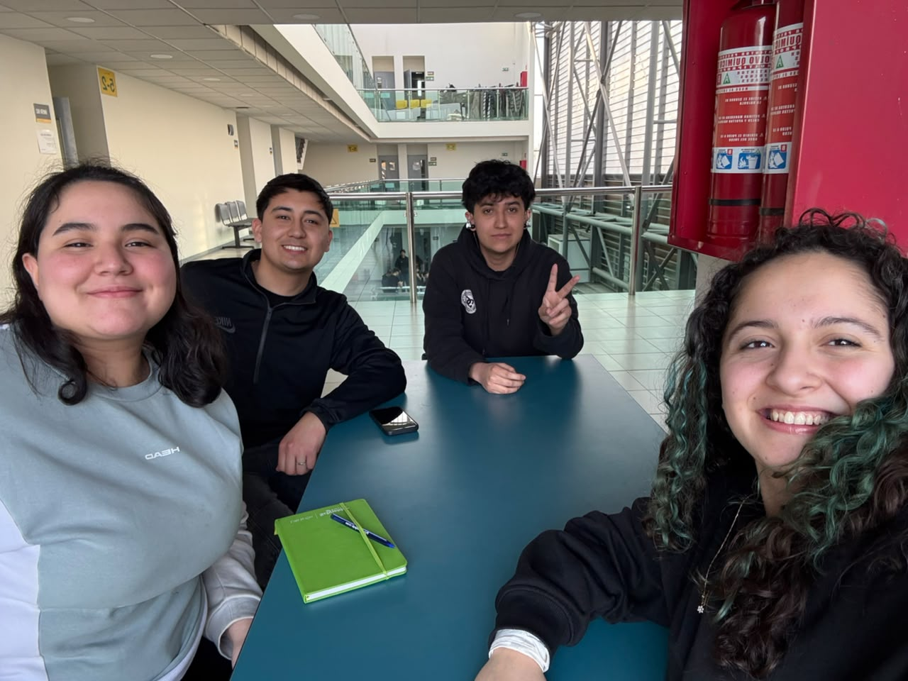

# Sistema de Registro y Caracterización de Usuarios

## Capstone Intermedio 2026

**Equipo:** Capstonersitos
**Desafío:** 01 | Edificios Inteligentes (Caracterización de usuarios del Hub Providencia)
**Contraparte:** Municipalidad de Providencia / Hub Providencia
**Estado actual:** En desarrollo

## Descripción
El Hub Providencia recibe diariamente a emprendedores, startups, estudiantes y visitantes, pero actualmente hay información limitada sobre quiénes utilizan el edificio y cómo se comportan. Nuestro proyecto consiste en diseñar e implementar una solución de registro e identificación de usuarios, acompañada de un dashboard de visualización, para apoyar la gestión y la toma de decisiones sin depender de software con licencias pagadas.

## Equipo
| Integrante | Carrera o especialidad | Rol inicial | Usuario de GitHub |
|---|---|---|---|
| Marcos Quilapan| Ingeniería Civil Industrial | Coordinación | [@tu_usuario_de_github] |
| Catalina Romero | [Carrera] | [Rol] | [@usuario] |
| Byron Gonzalez | [Carrera] | [Rol] | [@usuario] |
| Thiare Muñoz | Ingeniería Civil Industrial | Diseñadora| [@usuario] |

## Valores del equipo
- Compromiso con las entregas
- Escucha activa y respeto
- Puntualidad

## Normas de funcionamiento
1. Canal principal: Presencial; WhatsApp; Discord para reuniones.
2. Espera máxima de 10 minutos para iniciar reuniones.
3. Distribución equitativa de tareas.
4. Las decisiones se toman por votación de mayoría simple.
5. Los conflictos se conversan en equipo; si no hay acuerdo, se acude a la docente.

## Desafío inicial
Diseñar un prototipo funcional para registrar ingresos y analizar los perfiles de uso del Hub Providencia.
* **Lo que sabemos:** Falta información sobre los visitantes y se requiere un sistema que evite a los usuarios tener que completar sus datos en cada visita.
* **Lo que no sabemos:** Tecnologías óptimas sin costo para el contexto específico del Hub.
* **Supuestos a comprobar:** Los usuarios estarán dispuestos a realizar un enrolamiento inicial rápido si se les explica el beneficio.

## Objetivo SMART del equipo
Diseñar un prototipo funcional de registro de ingresos y un dashboard para el Hub Providencia, utilizando software sin costo, para presentarlo validado con datos reales al final del semestre.

## Compromisos individuales
| Integrante | Compromiso SMART |
|---|---|
| Marcos | Configurar el repositorio en GitHub y compilar la primera bitácora S01 y el README en Markdown para el 21-08-2026. |
| [Nombre 2] | [Compromiso] |
| [Nombre 3] | [Compromiso] |
| [Nombre 4] | [Compromiso] |

## Usuarios y contexto
El problema lo vive el equipo de gestión del Hub Providencia (al no tener datos estructurados para planificar) y los mismos usuarios del edificio (que enfrentan un proceso poco optimizado). Todo esto ocurre en las dependencias físicas del Hub Providencia.

## Plan inicial
| Actividad | Responsable(s) | Fecha | Estado |
|---|---|---|---|
| Configurar GitHub (README y S01) | Marcos | 21-08-2026 | Terminado |
| [Siguiente actividad] | [Nombre] | [dd-mm-aaaa] | Pendiente |

## Índice de la bitácora
- [S01 - Identidad del equipo y desafío](bitacora/S01.md)
- [S02 - Levantamiento inicial](bitacora/S02.md)
- [S03 - Empatizar](bitacora/S03.md)

## Evidencias principales
- [Por agregar a medida que avance el proyecto]

## Decisiones relevantes
| Fecha | Decisión | Evidencia o criterio utilizado |
|---|---|---|
| 20-08-2026 | Conformación de equipo y roles | Reunión inicial de Capstone |

## Próximo hito
Realizar el levantamiento del flujo actual de ingreso de los espacios en el Hub y comenzar a explorar opciones de registro sin costo de licencia.

## Uso y licencia
Por definir con el equipo docente y la contraparte. No reutilizar ni publicar información reservada sin autorización.
