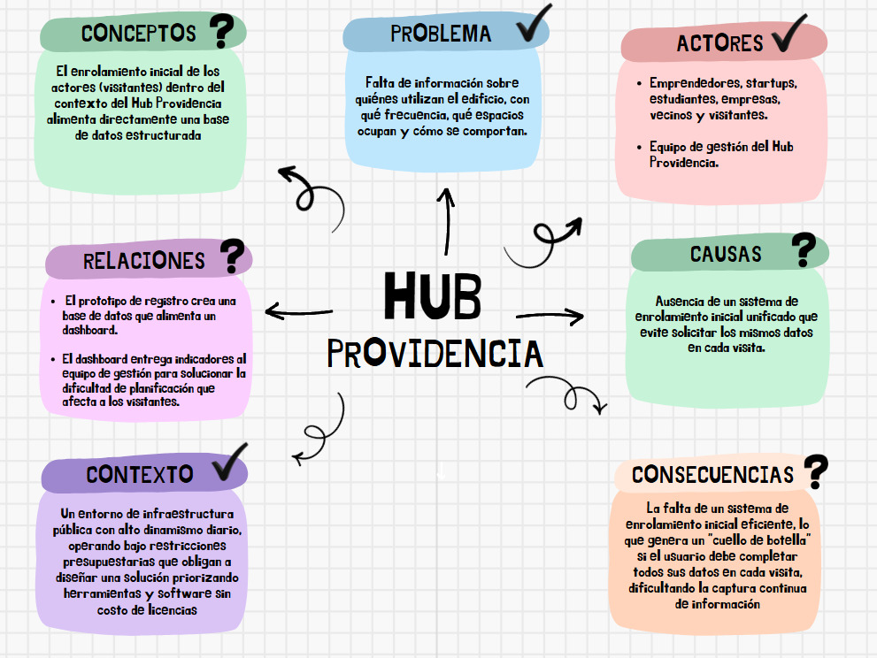
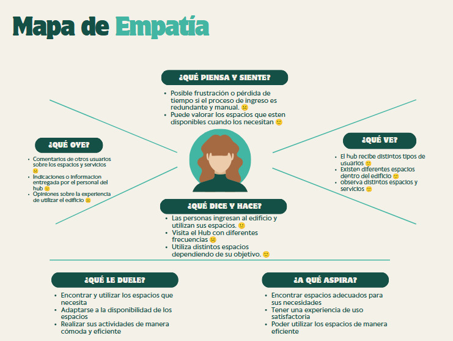

# S03 - Comprensión del Desafío y Mapas

**Fecha:** 27-08-2026.

**Participantes:** Marcos Quilapan, Thiare Muñoz, Catalina Romero, Byron Gonzalez.

## Objetivo de la sesión
Profundizar en el entendimiento del Desafío 01 (Hub Providencia) mediante la construcción de un mapa conceptual, la identificación de certezas/dudas, un mapa de empatía del usuario y la formulación de preguntas abiertas.

---

## 1. Mapa Conceptual y Análisis del Sistema

**Desglose del sistema:**
*   **Problema Central:** Falta de información sobre quiénes utilizan el edificio, con qué frecuencia, qué espacios ocupan y cómo se comportan.
*   **Actores Involucrados:** Emprendedores, startups, estudiantes, empresas, vecinos y visitantes. Equipo de gestión del Hub Providencia.
*   **Causas:** Ausencia de un sistema de enrolamiento inicial unificado que evite solicitar los mismos datos en cada visita.
*   **Consecuencias:** La falta de un sistema de enrolamiento inicial eficiente, lo que genera un "cuello de botella" si el usuario debe completar todos sus datos en cada visita, dificultando la captura continua de información.
*   **Contexto:** Un entorno de infraestructura pública con alto dinamismo diario, operando bajo restricciones presupuestarias que obligan a diseñar una solución priorizando herramientas y software sin costo de licencias.
*   **Conceptos Clave:** El enrolamiento inicial de los actores (visitantes) dentro del contexto del Hub Providencia alimenta directamente una base de datos estructurada.
*   **Relaciones:**  El prototipo de registro crea una base de datos que alimenta un dashboard. El dashboard entrega indicadores al equipo de gestión para solucionar la dificultad de planificación que afecta a los visitantes.

**Certezas y Dudas:**
*   **[✓] Sabemos:** El Hub recibe visitantes diarios y necesitamos una solución gratuita. (Problemas, Actores, Contexto).
*   **[?] Necesitamos saber:** ¿Cuál es la distribución física exacta del flujo de personas en las entradas? (Relaciones, Consecuencias, Causas, Conceptos).

---

## 2. Mapa de Empatía (Enfoque: Usuario Visitante)

**¿Qué piensa y siente?**
*   Posible frustración o pérdida de tiempo si el proceso de ingreso es redundante y manual. ☹️
*   Puede valorar los espacios que estén disponibles cuando los necesitan. 🙂

**¿Qué Ve?** 
*   El hub recibe distintos tipos de usuarios. 🙂
*   Existen diferentes espacios dentro del edificio. 🙂
*   observa distintos espacios y servicios. 🙂

**Qué Oye?**
* Comentarios de otros usuarios sobre los espacios y servicios. ☹️
* Indicaciones o informacion entregada por el personal del hub. 🙂
* Opiniones sobre la experiencia de utilizar el edificio. ☹️

**Qué Dice y Hace?**
* Las personas ingresan al edificio y utilizan sus espacios. 🙂
* Visita el Hub con diferentes frecuencias. ☹️
* Utiliza distintos espacios dependiendo de su objetivo. 🙂

**Qué le duele?**
* Encontrar y utilizar los espacios que necesita.
* Adaptarse a la disponibilidad de los espacios.
* Realiza sus actividades de manera cómoda y eficiente.

**A Qué aspira?**
* Encontrar espacios adecuados para sus necesidades.
* Tener una experiencia de uso satisfactoria.
* Poder utilizar los espacios de manera eficiente.
---

## 3. Preguntas Abiertas Generadas

1. ¿Cómo ocurre actualmente el flujo de ingreso y uso de los espacios en el Hub Providencia?  
2. ¿Qué tecnologías de identificación o registro son las más adecuadas para el contexto del edificio?  
3. ¿Qué variables relevantes se necesitan incorporar en la base de datos para caracterizar bien a los usuarios?  
4. ¿Qué herramientas o software sin costo de licencias existen para crear la base de datos y el dashboard?  
5. ¿Cómo podemos diseñar un enrolamiento inicial que evite que las personas completen todos sus datos en cada visita?
