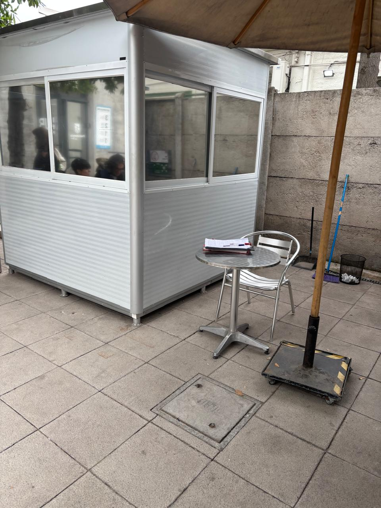
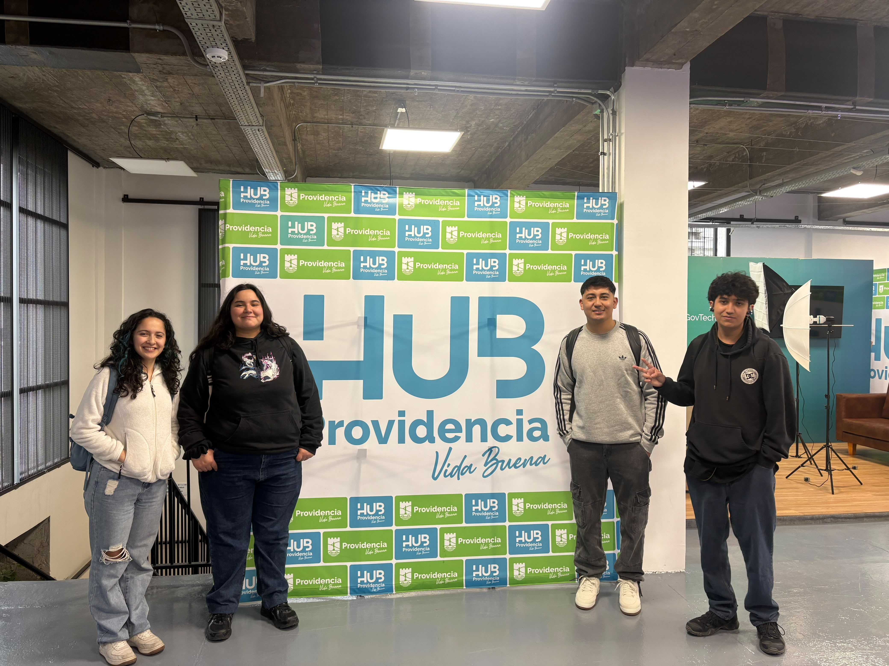

# S05 - Salida a Terreno: Visita al Hub Providencia

**Fecha:** 24-09-2026 *(Cambiar si fueron otro día)*

## Objetivo de la sesión
Realizar trabajo de campo en el Hub Providencia para validar nuestros supuestos iniciales, entender el flujo real del espacio mediante un tour guiado y responder las 5 preguntas prioritarias de nuestra investigación.

---

## 1. Validación en Terreno: Respuesta a nuestras preguntas

Durante nuestra visita interactuamos con el entorno y recopilamos la siguiente información clave:

**1. ¿Cómo registran actualmente a las personas que ingresan y qué información obtienen?**
*Respuesta:* Es libre demanda y no hay un proceso como tal, la gente llega al espacio ej llego al cowork en la mañana y llego acá y veo si hay espacio dispo a las 1 no hay un calendario disponible para ver si hay salas y espacios
No hay un mecanismo.En general el día a día son reservas constantemente

**2. ¿Qué información sobre sus usuarios necesitan para tomar decisiones y actualmente no tienen?
*Respuesta:* Que tanto vienen al hub, ya que como es un espacio gratuito la gente tiende a no asistir obligatoriamente, po lo que si se utilizara un sistema de toma de horas y esa persona falta habria otra persona la cual estaria perdiendo ese espacion si quisiera ocuparlo. 

**3. ¿Qué datos exactos se piden hoy al entrar y cuáles son indispensables?**
*Respuesta:* El RUT, Nombre, Ocupación. 

**4.¿Cómo identifican actualmente qué tipos de usuarios utilizan el Hub y con qué frecuencia lo visitan? **
*Respuesta:*: no hay manera como de indentificar que tipo de personas entra en el hub, mientras que la frecuencia podriamos revisar en el formulario que tanto las personas vienen. 

- su objetivo es optimizar las experiencia de usuarios.
- credencial para personas frecuentes. (aún no le tienen pero piensan ponerlo)
- ⁠si colocan un rut malo no se informa y queda guardado de esa manera, por lo que, ocasiona una pérdida de datos de la persona.
---

## 2. Recorrido por las instalaciones (Tour)

Posterior al levantamiento de datos, realizamos un tour completo por el recinto. Conocer la infraestructura del Hub Providencia fue fundamental para nuestro proyecto porque nos permitió:
*   Visualizar la distribución física de las entradas y entender dónde se generan los cuellos de botella.
*   Conocer los diferentes espacios (cowork, salas de reuniones, talleres) hacia donde se dirigen los usuarios luego de registrarse.
*   Identificar los mejores puntos estratégicos para ubicar nuestro futuro sistema de enrolamiento sin interrumpir el tránsito del edificio.

---

## 3. Registro Fotográfico

A continuación, la evidencia visual de nuestro trabajo de campo:

*(Nota: Estas son las fotos del recinto y del equipo trabajando)*

*Figura 1: Acceso principal e instalaciones del Hub Providencia.*

*Figura 2: El equipo recorriendo los espacios de trabajo del edificio.*
